# DCS Studio

**Build, debug, and share DCS World mods and missions — without leaving VS Code.**

DCS Studio brings the whole content-creator workflow for [DCS World](https://www.digitalcombatsimulator.com/) into your editor: a
community **marketplace** to discover and one-click-install mods, a guided path
from an empty folder to a **published mod on GitHub**, and a live link into a
running sim for a **Lua console, a step debugger, and log tailing**. It's built
for mission scripters and mod makers — including people who have never touched
git before.

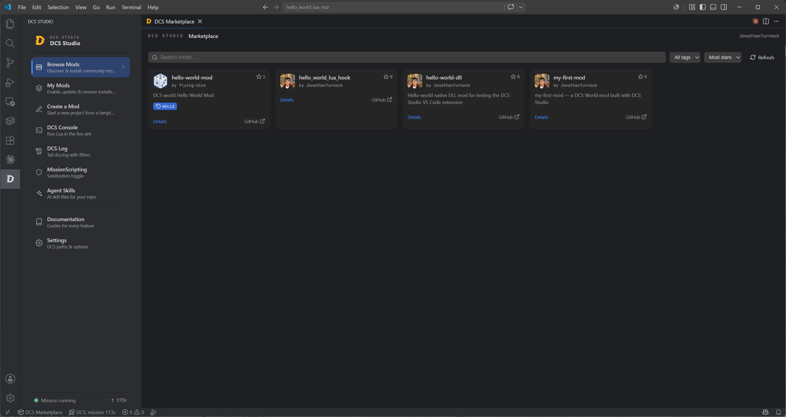

*The Marketplace: every public GitHub repo tagged `dcs-studio` shows up here — search, filter by tag, sort by stars, and install in one click.*

DCS Studio is the successor to [dcs-dropzone](https://github.com/flying-dice/dcs-dropzone)
and [dcs-fiddle](https://github.com/flying-dice/dcs-fiddle), rolling both into one
toolchain. Discovering, installing and managing other people's mods — what dropzone
did — now lives in the **Marketplace** and **My Mods** panels; live in-sim Lua — what
fiddle did — now lives in the **Lua console and explorer**. Whether you *play* mods or
*make and publish* them, it's all one workflow here.

---

## What you can do

- 🛒 **Discover & install mods** from a GitHub-backed marketplace — no account, no central registry, no gatekeeper.
- 🧩 **Manage your installs** — enable, disable, update or cleanly uninstall, with links (not copies) into your DCS folders.
- 🏗️ **Scaffold a project** from a template (mission script, GameGUI hook, Rust DLL, or "just share a `.miz`") with a form-driven manifest — no hand-written TOML.
- 🚀 **Publish to GitHub** in three guided steps, even if you've never used git — DCS Studio creates the repo, tags it, and cuts the release for you.
- 🖥️ **Run Lua live in the sim** with a REPL console and a browsable view of every global table.
- 🐞 **Debug Lua inside DCS** with real breakpoints, stepping, watches and variable inspection — press <kbd>F5</kbd> on a `.lua` file.
- 📜 **Tail `dcs.log`** with level filters and a live view of what your mod is doing.

---

## Feature tour

### Manage everything you've installed

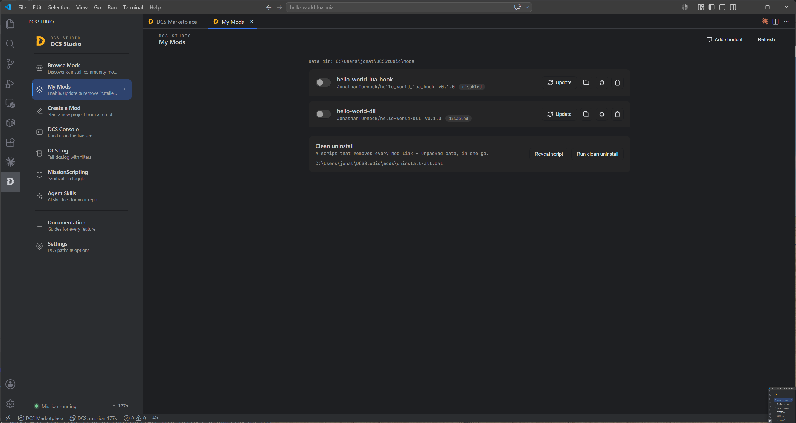

*My Mods is mission control for your installs: flip mods on or off, pull updates from their GitHub release, or uninstall without leftovers. Installs are lightweight links into your DCS folders — disabling is instant and never touches the downloaded files. A one-click "clean uninstall" removes every DCS Studio link if you ever want a fresh slate.*

### Create a mod without writing TOML

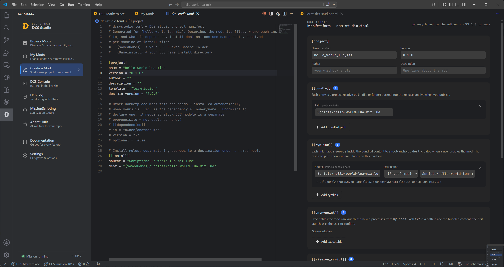

*Start from a template and DCS Studio scaffolds a working project, `dcs-studio.toml` and all. Opening the manifest gives you a form beside the editor that's two-way bound to the file — edit either side and the other follows. The manifest declares what gets **bundled** into your release and what gets **linked** into DCS on install; it's both your build recipe and the install plan users see before they download anything.*

### Run Lua live in the running sim

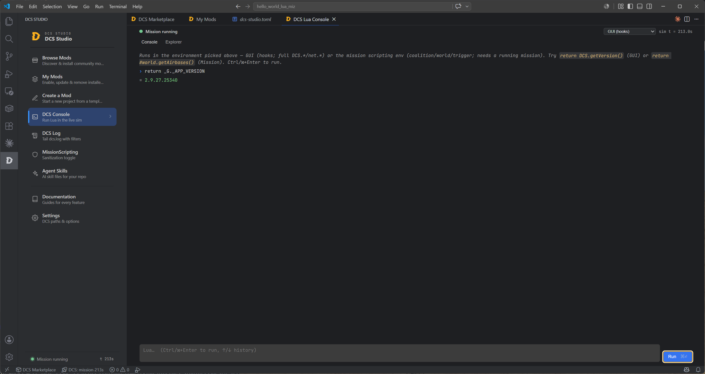

*The DCS Console is a live Lua REPL against a running DCS. Pick your target — the **GUI/hooks** state (`DCS.*`, `net.*`) or the **mission** scripting sandbox (`trigger.action`, `coalition`, `world`…) — type Lua, and see the result. `print(...)` output streams straight into the console.*

### Explore live game state

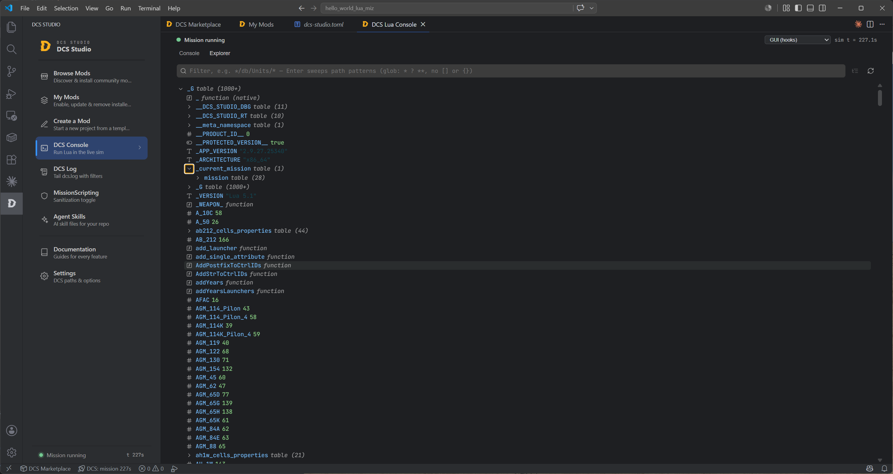

*The Explorer tab drills into live Lua tables as a lazily-expanding tree — filter with glob path patterns (e.g. `_G/**/Units`) to sweep straight to what you want. It's the fastest way to see what's actually in the sim right now.*

### Export the unit database (and any table) to JSON

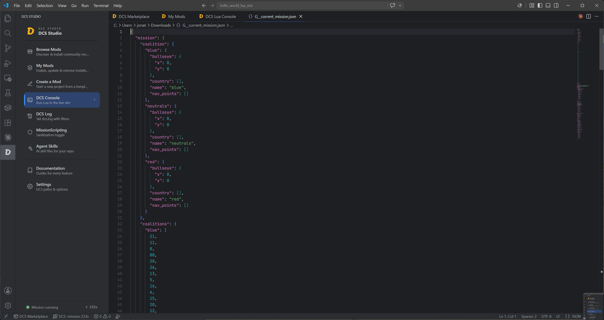

*Any live table can be exported to a JSON file of your choice — handy for the DCS **unit database** (units, weapons, pylons with resolved store names) or a snapshot of the current mission. Big dumps are written to disk rather than squeezed through the socket, so exporting "everything" just works.*

### Watch the log while you develop

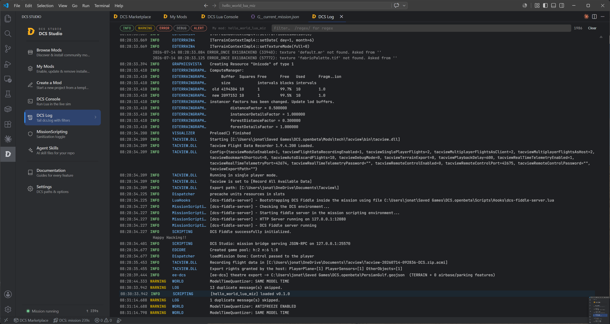

*The DCS Log viewer tails `dcs.log` in real time with level chips (INFO, WARNING, ERROR, DEBUG, ALERT), a regex filter, and a one-click "just my mod" filter — so you can spot your `[my_mod] loaded` line without scrolling through thousands of engine messages.*

### Debug Lua inside DCS

Full VS Code debugging — breakpoints, stepping, call stack, Locals/Upvalues/Globals
scopes, watches, hover evaluation, and a Debug Console you can assign into
(`x = 42` writes back into the paused frame) — for scripts running **inside the
live sim**, in both DCS Lua environments:

- **Mission** — the mission scripting sandbox. Needs a running mission and a desanitized `MissionScripting.lua` (see below).
- **GUI (hooks)** — the GameGUI state where hooks live.

Open any `.lua` file, set breakpoints in the gutter, and press <kbd>F5</kbd> (or
use the run/debug buttons in the editor title bar). A held breakpoint
auto-continues after 30 seconds if the editor disappears, so a crashed editor
can never freeze the sim.

### Safely manage the MissionScripting sandbox

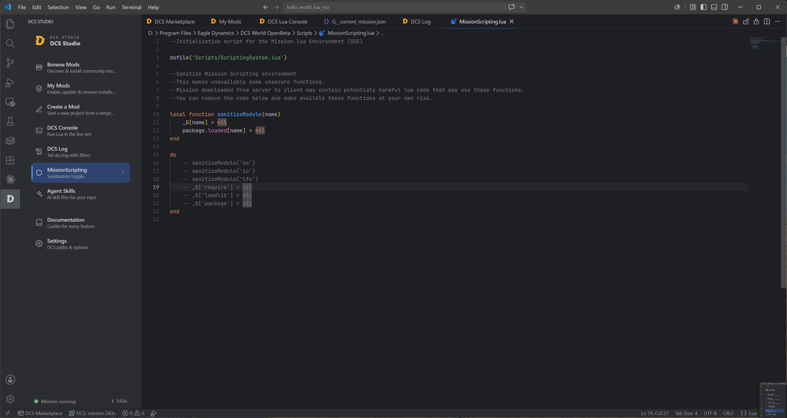

*DCS ships its mission Lua environment locked down — `os`, `io`, `lfs`, `require` and `package` are stripped for safety. Mission-side tooling (the bridge, the mission debugger, and some mods) needs some of that restored. **Desanitize** comments out the lockdown lines and writes a pristine backup first; **Re-sanitize** restores stock behaviour; **Restore** brings back the backup if an update ever clobbers the file. It's an honest, reversible toggle — desanitizing grants filesystem and OS access to mission scripts, so re-sanitize when you're done developing.*

### Teach your AI agent the project

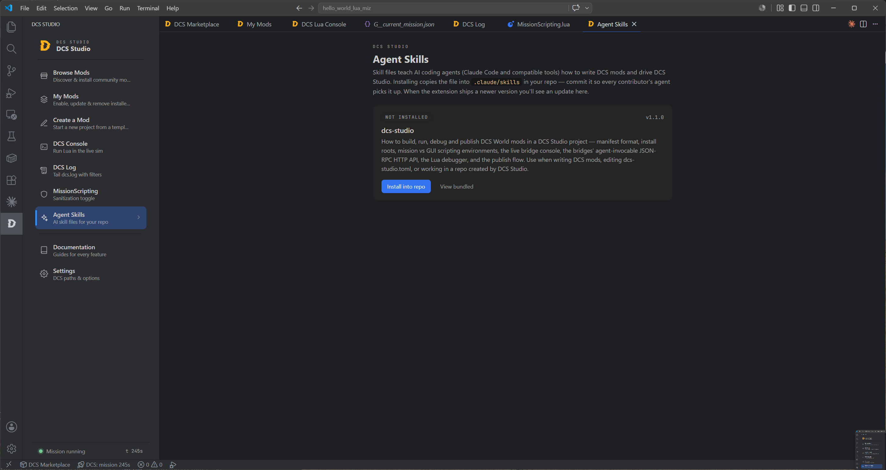

*DCS Studio bundles a skill file that teaches AI coding agents (Claude Code and compatible tools) how to write DCS mods, edit the manifest, and drive the bridge. Install it into your repo and commit it, and every contributor's agent picks it up.*

### Learn as you go

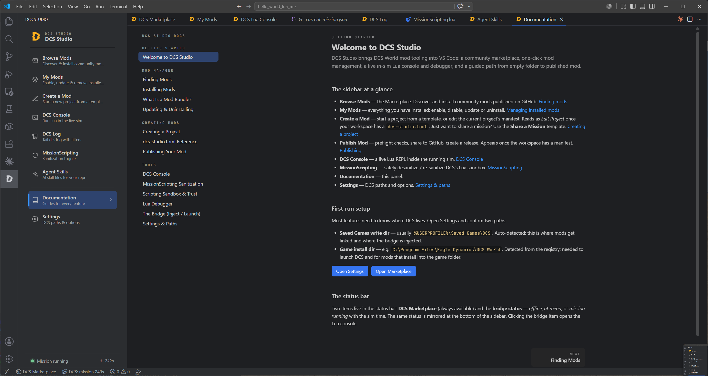

*Every feature has a guide built right into the extension — from finding mods to the full `dcs-studio.toml` reference to the publish flow. No need to leave the editor to figure out what a button does.*

---

## Getting started

### 1. Install

- **From the Marketplace:** search for **DCS Studio** in the VS Code Extensions view and click Install.
- **From a `.vsix`:** download the latest release, then run **Extensions: Install from VSIX…** from the Command Palette.

### 2. Point DCS Studio at your DCS folders

Open the **DCS Studio** icon in the activity bar → **Settings**. The setup panel
auto-detects the two paths most features need and shows a green check when each
is valid:

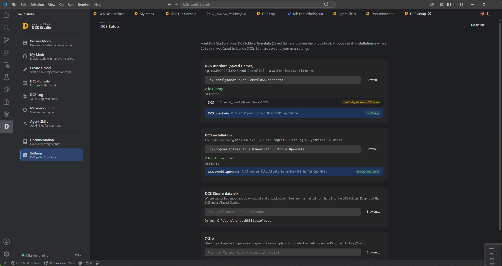

*DCS Setup finds your **Saved Games** write dir (where mods link and the bridge installs — validated by its `Config` folder) and your **DCS installation** (where `DCS.exe` lives — used to launch the sim). Both auto-detect; override with Browse if you run a non-standard layout.*

### 3. Turn on the live features (optional)

The console, debugger and log tailing talk to DCS through a small **bridge**
(a native DLL + hook script that installs into your Saved Games folder):

1. Run **DCS Studio: Launch DCS (with bridge)** — this injects the bridge and starts DCS for you (when DCS exits, the bridge is ejected automatically). Or inject it yourself with **Inject Bridge into DCS** and launch DCS however you like.
2. Wait for the status bar to show the bridge online (*at menu* or *mission running*).
3. For the **mission** environment (mission debugger / mission console), also run **DCS Studio: Desanitize MissionScripting.lua** and restart DCS. This unlocks the mission Lua sandbox so the mission bridge can boot — a reversible change with an automatic backup. Re-sanitize when you're done.

### 4. Make something

Run **Create a Mod** from the sidebar, pick a template, and you're off. When
you're ready, **Publish Mod** walks you through sharing it to GitHub and cutting
a release — the two things that make your mod appear in the marketplace for
everyone else.

---

## Requirements

- **VS Code** `^1.125.0` or newer.
- **Windows** — DCS World is Windows-only, and so are the paths and links DCS Studio manages.
- **DCS World** installed — needed for installing mods, the live bridge, and everything that touches the sim. (The marketplace itself works without DCS.)
- **git** and the **GitHub CLI** (`gh`, signed in) — only needed if you want to *publish* a mod. Not required for browsing, installing, or scripting.
- **7-Zip** — used to pack and unpack mod payloads. Auto-detected on your PATH; set a path in Settings if it lives somewhere unusual.

---

## What DCS Studio *isn't*

DCS Studio is deliberately focused. It is **not**:

- **A Lua language server** — no autocomplete, no type-checking, no linting of your Lua. Pair it with a Lua LSP extension if you want that.
- **A dependency manager or bundler** — it packs the paths you declare and links them into DCS; it doesn't resolve npm-style dependency trees or transpile anything.

GitHub Releases are the source of truth for every mod — there's no server to
sign up for and nothing self-hosted.

---

## Development

DCS Studio is open source under the [MIT license](LICENSE). Contributions welcome.

- **[ARCHITECTURE.md](ARCHITECTURE.md)** — the hexagonal core, the composition root, and how the pieces fit together.
- **Automation & agents** — both bridges expose a JSON-RPC HTTP API (`POST /rpc`) and serve an **OpenRPC** document via `rpc.discover`, so scripts and LLM agents can drive a running sim over plain HTTP. See [`skills/dcs-studio/SKILL.md`](skills/dcs-studio/SKILL.md).
- **Bridge JSON-RPC API** — the full method surface for both bridges is documented, with live-fetch and Playground links, in [`docs/bridge-api.md`](docs/bridge-api.md). Browse it instantly in the OpenRPC Playground: [GUI bridge](https://playground.open-rpc.org/?url=https://raw.githubusercontent.com/flying-dice/dcs-studio/main/bridge/crates/bridge-gui/openrpc/dcs_studio_gui.openrpc.json) · [mission bridge](https://playground.open-rpc.org/?url=https://raw.githubusercontent.com/flying-dice/dcs-studio/main/bridge/crates/bridge-mission/openrpc/dcs_studio_mission.openrpc.json).
- **Build:** `npm install && npm run compile`, then press <kbd>F5</kbd> to launch an Extension Development Host.
- **Tests:** `npm test` (Vitest unit tests, 100% per-file core coverage) and `npm run test:e2e` (Playwright webview specs).
